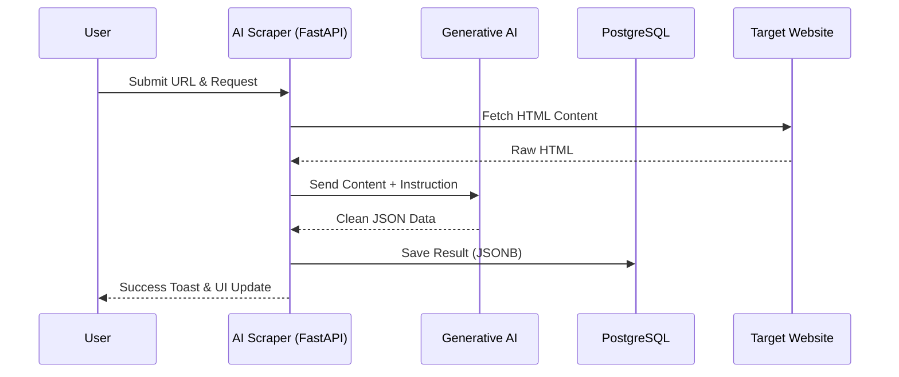
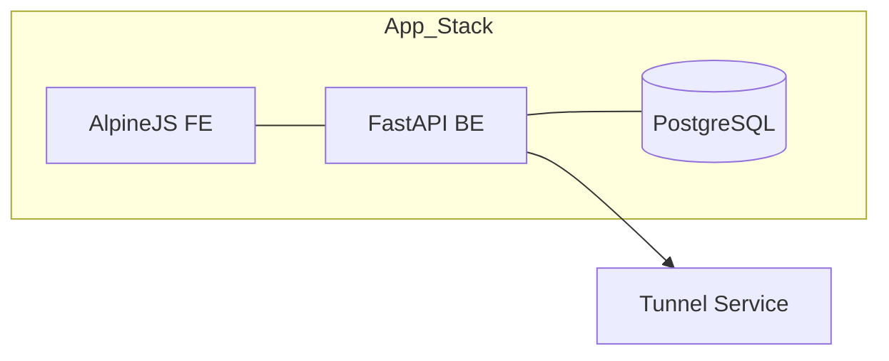

# AI Scraper 🐒
Intelligent web scraping and data extraction tool powered by Gemini AI.



## Architecture


## Setup
1. Configure your API key in the Settings tab.
2. Run with Docker:
```bash
docker compose up -d --build
```
